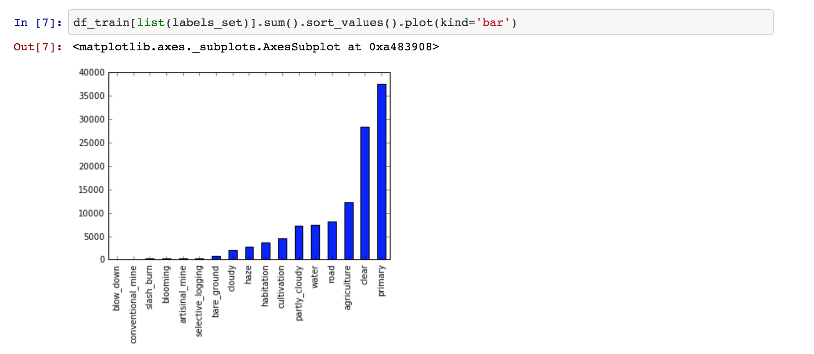

# Machine Learning Engineer Nanodegree

## Capstone Proposal - Classification
Jordan Carson  
January 15th, 2018

### Domain Background

Climate change is drastically affecting the habitat in the Amazon and there is an on-going concern that the Amazon will be caught up in a set of "feedback loops" that could drastically speed up the pace of forest lost and degradation, leading to a point of no return. 

According to Kaggle, “Every minute, the world loses an area of forest the size of 48 football fields. And deforestation in the Amazon Basin accounts for the largest share, contributing to reduced biodiversity, habitat loss, climate change, and other devastating effects. But better data about the location of deforestation and human encroachment on forests can help governments and local stakeholders respond more quickly and effectively.”

In this project, I will be creating a classification system to label satellite image chips with atmospheric conditions and various classes of land cover/land use. This is related to the Kaggle competition titled ‘Planet: Understanding the Amazon from Space’.

### Problem Statement

Given a dataset of satellite images for the Amazon, an algorithm needs to be developed to classify each image listed in the test set with a tag that is believed to be associated to the image. There are 17 possible tags: agriculture, artisinal_mine, bare_ground, blooming, blow_down, clear, cloudy, conventional_mine, cultivation, habitation, haze, partly_cloudy, primary, road, selective_logging, slash_burn, water. 

The goal of this project is to train and build a deep learning model that is able to recognize an entire dataset of imagery from the amazon and properly label it with the appropriate tagging.

This competition contains over 40,000 training images, which could contain multiple labels. The 17 possible tags/labels can broadly be broken into three groups: atmospheric conditions, common land cover/land use phenomena, and rare land cover/land use phenomena. Each chip – a chip size is 256x256 pixels – will have at least one and the potential to have more than one atmospheric label and zero or more common and rare labels. See below for the sample chips and their labels as provided by Planet’s impact team.  

The chip labels can be boisterous due to the labeling process and ambiguity of features, and scenes may omit class labels or have incorrect class labels. This problem and Kaggle challenge is to figure out how to work with noisy data and features that are ambiguous. 

### Datasets and Inputs

The datasets for this project are all located in Kaggle.

According to Kaggle, “The chips for this competition were derived from Planet's full-frame analytic scene products using our 4-band satellites in sun-synchronous orbit (SSO) and International Space Station (ISS) orbit. The set of chips for this competition use the GeoTiff format and each contain four bands of data: red, green, blue, and near infrared. The specific spectral response of the satellites can be found in the Planet documentation. Each of these channels is in 16-bit digital number format, and meets the specification of the Planet four band analytic ortho scene product."

With the training set, the shape of the dataframe is (40669, 2) - thus we are given roughly 40,000 training images. With this dataset, there are a total of 116484 non-unique tags in all of the training images.

The chart below shows the count of labels that are available in the training data-set. Kaggle distributes the image data in both training and test sets in jpg and tiff file extensions. In this project I will be using jpg images as inputs into my deep learning model.

 

The distribution of the training labels shows that the data is not evenly distributed. In fact, it will be easier to predict the tags that occur more frequently then the ones that occur less frequently.

### Solution Statement

I plan to build and implement a deep learning model for the final solution. This is because deep learning models should be more effective at determining the relative features from a given image in our dataset rather than other computer vision techniques. 

A convolution neural network will be built that can be trained on the training data (imagery.) The deep learning network will be built using tensorflow and Keras.

### Benchmark Model

Without using a deep learning model and manually mapping the labels and predictions to a binary score I was able to obtain a f2 score of ~80%. This will be my target benchmark rate to beat using deep learning methods. Additionally, there have been cases posted to Kaggle kernels of individuals achieving rates in the high ~90%s. This is a more aspirational goal as these individuals used deep learning and image processing techniques to greatly improve their accuracy.

### Evaluation Metrics

The deep learning model will be evaluated using the function below, which is a way of combining precision and recall into a single score metric like F1, however recall is weighted higher than precision. But, more importantly, I will also implement a loss function (in particular a log-loss function) that will be able to calibrate which deep learning model to pay more attention to when optimizing the labels recall.

The final solution and accuracy will be based on the above equation - f2 score. I will also use a logloss function to compare the different deep learning models to use as my final solution. Log-loss is another measure of accuracy that brings in probability confidence. Essentially, it is the cross entropy between the distribution of the true labels and the models predictions. Cross-entropy incorporates the detoriation of the distribution, plus the unpredictability when one assumes a different distribution that the true distribution. Therefore, log-loss is a measure to guage the noise that comes from using a predictor as opposed to the true labels. We must minimize the cross-entropy, or the log-loss as they are essentially the same, to maximize the accuracy of our proposed classifier.

### Project Design

The first stage of the project will be to download and preprocess the imagery data from Kaggle.com. As I mentioned above, the data is available in both jpg and tiff file extensions - for the sake of this project, I will be using the jpg files with the pillow library. 

Once I have gathered the information, the next step will be to preprocess the jpg files before being consumed by my deep learning methods. In this stage I will use data argumentation and feature engineering techniques from tensorflow, and keras. This will be a very involved part of my solution consisting of resizing, flipping, rotating, transposing and transforming the images in both the training and test sets. There are other involved image processing techniques such as haze removal for the algorithm to see the images more clearly. This was done by the 1st place winner on the Kaggle competition. See the source below for more detail. 

After all the feature engineering, I will create a deep learning model consisting of convolution neural networks, with different numbers of parameters and layers to compare the best model to classify the images. I am assuming there will be a layer of fine-tuning the weights to figure out the best overall performance.

Lastly, the goal of this project is using a combination of feature engineering and deep learning to create the best classification system. Friends and colleagues have identified using AWS EC2 as a popular cloud computing network to train the built deep learning model. I will evaluate if this is necessary, as this will not improve my models accurary nor precision.

### Sources:

1st place winner interview on Kaggle Competition:
http://blog.kaggle.com/2017/10/17/planet-understanding-the-amazon-from-space-1st-place-winners-interview/

http://www.di.ens.fr/willow/research/cnngeometric/

http://search.arxiv.org:8081/paper.jsp?r=1712.00720&qid=1516684733782bas_nCnN_1902725897&qs=convolution+neural+network+and+computer+vision&in=cs

https://arxiv.org/pdf/1605.09081.pdf

